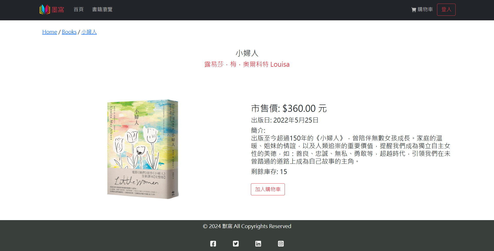

# 書籍購物網站使用說明

### 使用語言:
- 前端：React
- 後端：Node.js
- 資料庫：SQL

### 前後端應用:
- REST API (webshop-api) http://localhost:3001
- Client App (webshop-app) http://localhost:3000

### 測試方法
1. 連接網路!!!
2. 進入 bookshop\bookshop-react-master\webshop-api
3. 於 terminal 輸入 npm install (必要時請用 --force)
4. 於 terminal 輸入 npm start -> 後端成功開啟
5. 進入 bookshop\bookshop-react-master\webshop-app
6. 於 terminal 輸入 npm install (必要時請用 --force)
7. 於 terminal 輸入 npm install chart.js react-chartjs-2(必要時請用 --force)
8. 於 terminal 輸入 npm start -> 前端成功開啟
9. 執行 \webshop-api\data\CREATE_DATABASE_project.sql，建立表格
10. 執行 \webshop-api\data\final_insert_script.sql，插入所有測試資料
11. 已完成前置作業

### 頁面及功能說明
- 首頁
- 註冊及登入頁面：註冊及登入後網頁會自動跳轉，請稍等
- 書籍瀏覽：買家買書的地方，顯示簡易書籍資訊及提供加入購物車功能
- 詳細書籍資訊(看更多)：顯示書籍詳細資訊，並提供加入購物車功能
- 書籍管理：賣家(僅看的到自己的書)及管理員(可以看到全部的書)可以異動書籍資訊及增加書籍至商城 *書籍照片請置於 \webshop-app\public\images\ 中
- 會員管理：控制各會員的賣家和管理員的權限
- 訂單管理：異動各訂單狀態
- 優惠券管理：控管各優惠券狀態(可恢復使用或停止使用)、發送優惠券給單一會員
- 營收管理：檢視商城中所有賣家之營收狀況
- 個人營收：檢視自己的營收狀況(附上圓餅圖及長條圖)
- 購物車：檢視、增減、刪除目前的購物車商品
- 結帳頁面：提交訂單資訊，讓訂單成立
- 個人資料：檢視及修改個人資料登錄
- 歷史訂單：檢視自己過往的歷史訂單
- 我的優惠券：檢視目前可用之優惠券

### 權限說明
- 所有使用者 可使用：首頁、註冊頁面、登入頁面、詳細書籍資訊、購物車(但非登入者不會有商品)
- 登入者 可使用：加入購物車、結帳頁面、個人資料、歷史訂單、我的優惠券
- 賣家及管理員 可使用：書籍管理、個人營收
- 管理員 可使用：會員管理、訂單管理、優惠券管理、營收管理

### 照片集
- 註冊

- 登入

- 首頁

- 書籍瀏覽頁面
    - 勾選類別及利用搜尋篩選書籍
    - 點選「看更多」進入書籍詳細資料頁
    - 於庫存為0時顯示「售罄」

- 書籍詳細資料頁

- 購物車頁面

- 結帳頁面

- 歷史訂單頁面

- 我的優惠券頁面

- 書籍管理頁面 (限賣家、管理員)
    - 點選編輯異動書籍資料
    - 點選新增書籍加入書籍資料

- 會員管理頁面 (限管理員)
    - 可異動會員之賣家、管理員權限

- 訂單管理頁面 (限管理員)
    - 管理員可以更新訂單狀態
    - 可以查看訂單詳細內容

- 優惠券管理頁面 (限管理員)
    - 管理員可以發配及修改各個會員的優惠券

- 營收管理 (限管理員)

- 個人營收分析 (限賣家、管理員)

